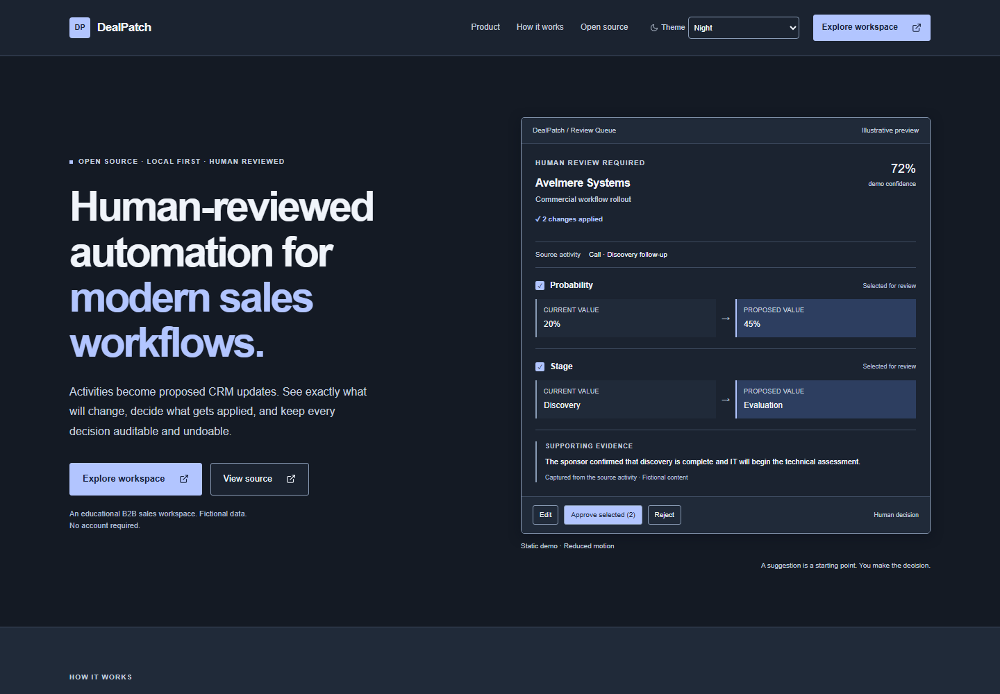
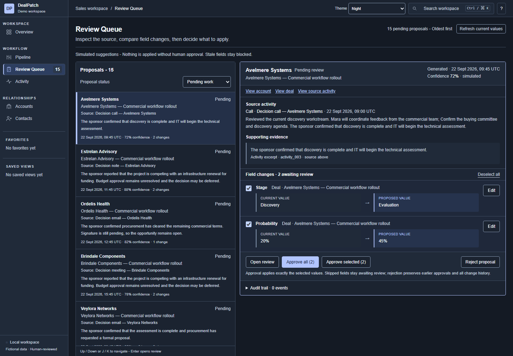

# DealPatch

DealPatch is an open-source, local-first B2B sales workspace exploring transparent,
human-reviewed CRM automation. It is an educational and portfolio project using
fictional data.

## Human-reviewed automation

Activity → simulated analysis → proposed CRM change → human review → approve / edit / reject → audit / undo

Changes are never applied automatically. Users can inspect supporting evidence,
approve selected fields, and edit or reject proposals. Applied changes remain
auditable and undoable.

## Screenshots

### Landing page



### Workspace overview


### Review Queue



### Deal detail


## What DealPatch includes

- Sales pipeline, accounts and contacts, and deal/opportunity detail
- Activity analysis and human-reviewed proposals with field-level diffs
- Partial approval and stale-change protection
- Optimistic updates with rollback, undo and audit history
- Favorites and Saved Views
- Global search and keyboard navigation
- Time-aware Morning / Afternoon / Evening / Night themes
- Local IndexedDB persistence

## Local-first demo

- Fictional data only; no real customer data
- No account required
- No external database or AI provider
- No API keys or environment variables required
- Data persists locally in the browser

DealPatch is not intended to be a production CRM service. Clearing browser storage
removes local workspace data.

## Tech stack

- Next.js
- React
- TypeScript
- Tailwind CSS
- TanStack Query
- TanStack Table / Virtual
- Dexie / IndexedDB
- Zod
- Playwright

## Running locally

Use Node.js 24 and npm.

```bash
git clone https://github.com/shubhbatra1991/dealpatch.git
cd dealpatch
npm install
npm run dev
```

Open [DealPatch](http://localhost:3000) or go directly to the
[workspace](http://localhost:3000/workspace).

## License

Licensed under the [MIT License](LICENSE).
