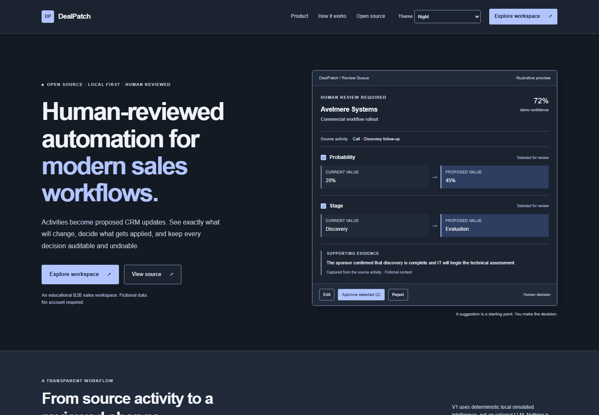
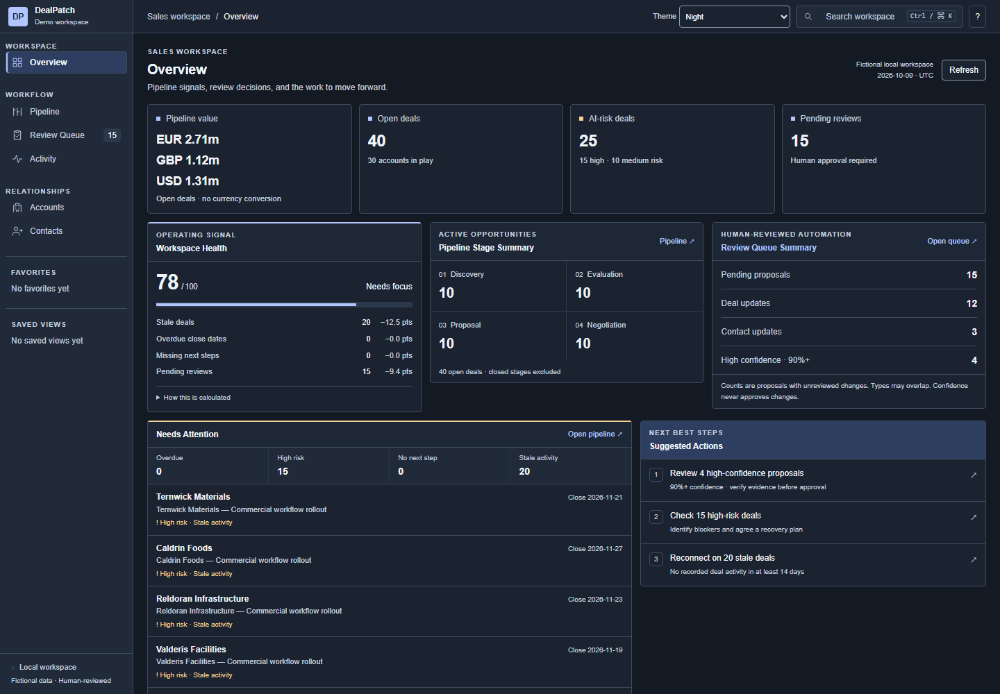
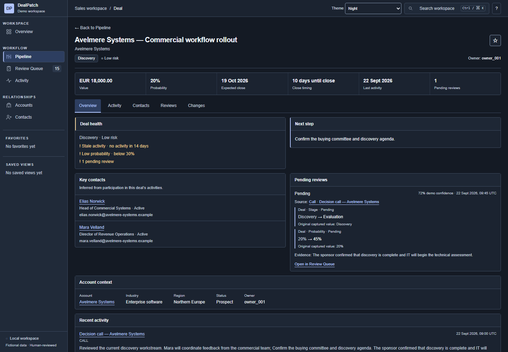

# DealPatch

Human-reviewed automation for modern sales workflows.

DealPatch is an open-source, local-first B2B sales workspace for learning,
experimentation and portfolio demonstration. Activities produce proposed CRM
updates with evidence and before/after diffs. A person edits, approves, partially
approves or rejects suggestions. Applied changes remain auditable and undoable.

V1 uses deterministic local simulated intelligence, not an external LLM. All
companies and people are fictional. This is an educational project, not a
production-ready CRM.

## Run locally

```sh
git clone https://github.com/shubhbatra1991/dealpatch.git
cd dealpatch
npm install
npm run dev
```

Use Node.js 24 and npm (validated with Node 24.19.0 / npm 11.6.2).

Open [the showcase](http://localhost:3000/) or
[the workspace](http://localhost:3000/workspace).
No account, API keys, environment variables, external database or AI provider are
required. Data persists in this browser's IndexedDB. Clearing browser storage
removes local work; it is not secure storage or a backup.

## Routes and layers

- `/`: public showcase with a static illustrative review preview.
- `/workspace`: Overview.
- `/workspace/pipeline`: opportunities, filters and saved views.
- `/workspace/accounts` and `/workspace/accounts/[accountId]`.
- `/workspace/contacts` and `/workspace/contacts/[contactId]`.
- `/workspace/deals/[dealId]`: opportunity context and change history.
- `/workspace/activity`: activity → simulated analysis → review proposal.
- `/workspace/reviews`: human review, conflicts, outcomes and audit history.

The landing page does not initialize the workspace database or mount its shell,
search or QueryClient. Both layers share Morning, Afternoon, Evening, Night and
Automatic themes. CRM links use `/workspace/...`; old root workspace paths have
no compatibility redirects. Existing browser data is preserved.

## Engineering patterns

Next.js App Router, React, TypeScript and Tailwind; TanStack Query/Table/Virtual;
Dexie/IndexedDB; Zod validation. The workspace demonstrates dense virtualized
surfaces, keyboard navigation, optimistic approval, atomic local writes,
stale-value protection, safe Undo and append-only audit events.

## Screenshots


<details>
<summary>Landing page, Overview and Deal Detail</summary>





</details>

## Validate

```sh
npm run typecheck
npm run lint
npm test
npm run build
npm run test:e2e
```

Install browsers once with `npx playwright install chromium firefox webkit`. E2E tests
run the production build on port 3100, with fresh contexts and real IndexedDB.
Screenshot baselines target Chromium on Windows. See [browser testing](tests/e2e/README.md),
[accessibility](docs/ACCESSIBILITY.md) and [performance](docs/PERFORMANCE.md).

## Documentation

[Architecture](docs/ARCHITECTURE.md) · [Design system](docs/DESIGN_SYSTEM.md) ·
[Theming](docs/THEMING.md) · [Security](docs/SECURITY.md) · [Roadmap](docs/ROADMAP.md).

[All documentation](docs/Readme.md) · [Contributing](CONTRIBUTING.md) ·
[Security disclosure](SECURITY.md) · [Release readiness](docs/RELEASE_READINESS.md).

Public source/docs/security/license links are configured in `lib/project.ts`,
without environment variables or a deployment origin.

Licensed under the [MIT License](LICENSE).
